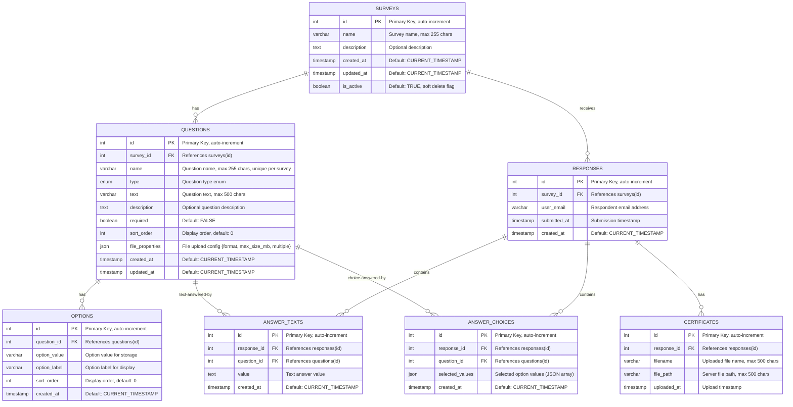

# Sky Survey API - Entity Relationship Diagram (ERD)

## Table Relationships Summary

| Parent Table | Child Table | Relationship | Foreign Key | Constraint |
|---|---|---|---|---|
| **surveys** | **questions** | One-to-Many | `survey_id` | ON DELETE CASCADE |
| **surveys** | **responses** | One-to-Many | `survey_id` | ON DELETE CASCADE |
| **questions** | **options** | One-to-Many | `question_id` | ON DELETE CASCADE |
| **questions** | **answer_texts** | One-to-Many | `question_id` | ON DELETE CASCADE |
| **questions** | **answer_choices** | One-to-Many | `question_id` | ON DELETE CASCADE |
| **responses** | **answer_texts** | One-to-Many | `response_id` | ON DELETE CASCADE |
| **responses** | **answer_choices** | One-to-Many | `response_id` | ON DELETE CASCADE |
| **responses** | **certificates** | One-to-Many | `response_id` | ON DELETE CASCADE |

## Unique Constraints

| Table | Constraint Name | Columns |
|---|---|---|
| **questions** | `unique_survey_question` | `(survey_id, name)` |
| **answer_texts** | `unique_answer_text` | `(response_id, question_id)` |
| **answer_choices** | `unique_answer_choice` | `(response_id, question_id)` |

## Question Types (ENUM)

| Value | Description |
|---|---|
| `short_text` | Short text answer |
| `long_text` | Long text/paragraph answer |
| `email` | Email address answer |
| `single_choice` | Single choice (radio button) |
| `multiple_choice` | Multiple choice (checkbox) |
| `file` | File upload (e.g., PDF certificate) |
